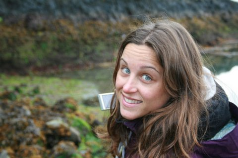

---
---
  
<link rel="stylesheet" href="styles.css" type="text/css">
    

I have been studying ecological interactions in relationship to their environment since the beginning of my career, I have done this with different study subjects and different environments. As a student I was always driven by the scientific questions and the experimental design rather than the specific study subjects. 
    
During the PhD degree I started studying how the outcome of plant-animal trophic interactions affects spatio-temporal plant population genetics, which made me increasingly curious on how animal movement influences the landscape through seed dispersal.
    
By the end of my PhD I understood throughly gene flow through seed dispersal is crucial to maintain biodiversity and how this can be crucial in fragmented heterogeneous landscapes under environmental/human pressure. So to understand seed movement within heterogenous landscapes, I developed a project to study seed dispersal in the most heterogenous landscape there is, urban areas, by the long-distance dwellers, red foxes. This project is now funded by the German Research Foundation, and I will be working on this for the next few years at the [University of Toronto](https://www.utoronto.ca/) hosted by [Prof. Marie-Josee Fortin](https://fortin.eeb.utoronto.ca/), where I will be using ecological modeling to understand the role of foxes on landscape connectivity within the urban matrix .
    
My full CV is available [here](files/Academic CV - Tiziana A. Gelmi Candusso_december 2019.pdf).

